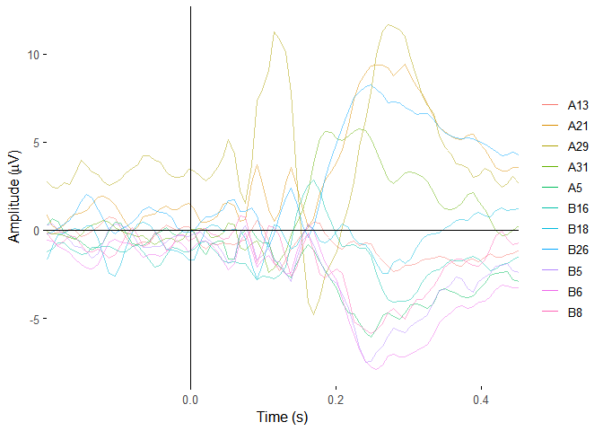
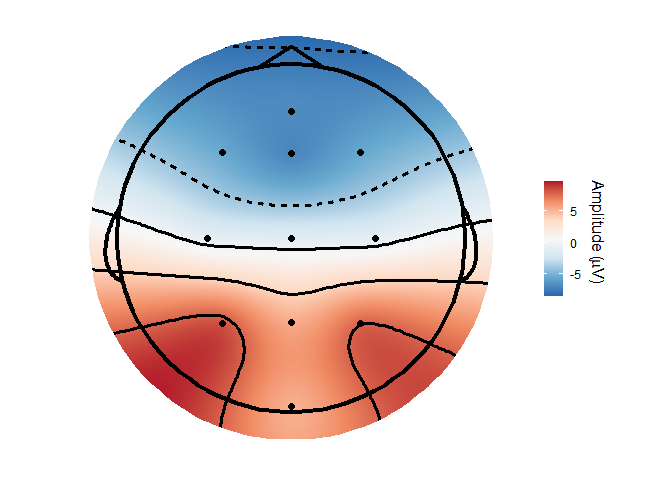
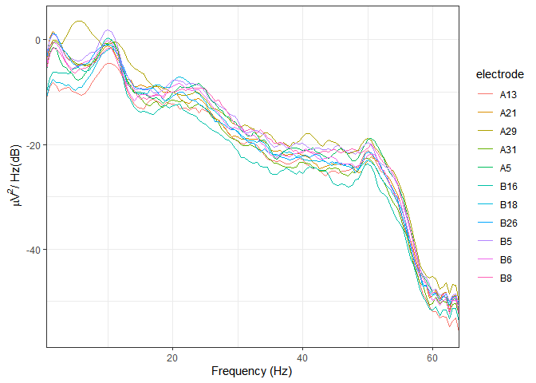
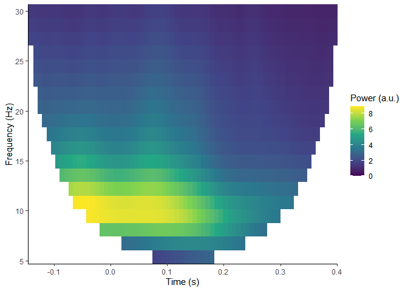

eegUtils
================

<!-- badges: start -->

[](http://www.repostatus.org/#wip)
[](https://codecov.io/github/craddm/eegUtils?branch=master)
[](https://github.com/craddm/eegUtils/actions)
<!-- badges: end -->
[](https://zenodo.org/badge/latestdoi/85406871)

## Overview

*eegUtils* is a package for the processing, manipulation, and plotting
of EEG data. It includes functions for importing data from a variety of
file formats (including Biosemi, Brain Vision Analyzer, and EEGLAB),
many of the typical steps in pre-preprocessing (filtering, referencing,
artefact rejection), more advanced processing techniques (time-frequency
analysis, ICA), and several types of plot that are common in the field
(ERP plots, time-frequency plots, topographical scalp maps). Although it
uses custom object classes, it is designed such that these are always
translatable to standard R *data.frames*, and thus can be used with any
of the myriad packages and methods that support standard R formats.

## Installation

The package is very much under active development and is subject to a
lot of changes. As such, it is not currently available on CRAN.

Install the latest released version from Github as below.

``` r
#install.packages("remotes")
remotes::install_github("craddm/eegUtils")
```

To install the latest development version, install from the *develop*
branch as below.

``` r
remotes::install_github("craddm/eegUtils@develop")
```

You can also find the package on
[Neuroconductor](https://neuroconductor.org) - for more information
about installing packages from Neuroconductor, see the [Neuroconductor
installation tutorial](https://neuroconductor.org/tutorials/install)

## Usage

The following examples show how to use `eegUtils` to produce a few
common plots of EEG data from some simple included example data.

### ERP butterfly plots

``` r
library(eegUtils)
#> 
#> Attaching package: 'eegUtils'
#> The following object is masked from 'package:stats':
#> 
#>     filter
plot_butterfly(demo_epochs)
```

<!-- -->

### Topographical plots

``` r
topoplot(demo_epochs, 
         time_lim = c(.22, .25 ))
#> Using electrode locations from data.
#> Plotting head r 95 mm
```

<!-- -->

### Power spectral density

``` r
plot_psd(demo_epochs)
#> Removing channel means per epoch...
#> Computing Power Spectral Density using Welch's method.
#> FFT length: 256
#> Segment length: 84
#> Overlapping points: 42 (50% overlap)
```

<!-- -->

### Time-frequency analysis

``` r
plot_tfr(compute_tfr(demo_epochs,
                     foi = c(4, 30),
                     n_freq = 20,
                     n_cycles = 3))
#> Computing TFR using Morlet wavelet convolution
#> Output frequencies using linear spacing: 4 5.37 6.74 8.11 9.47 10.84 12.21 13.58 14.95 16.32 17.68 19.05 20.42 21.79 23.16 24.53 25.89 27.26 28.63 30
#> Removing channel means per epoch...
#> Returning signal averaged over all trials.
```

<!-- -->

There are many potential processing steps that precede the production of
plots like these. For more examples of how to import and process data,
or import data from other sources, see the [eegUtils
website](https://craddm.github.io/eegUtils)!

## Contributing

If you have any bug reports or feature requests, please report them
using the [Github issue
tracker](https://github.com/craddm/eegUtils/issues).

If you would like to contribute any code, be that anything from a
documentation fix to a whole new feature, then please begin by raising
an [issue](https://github.com/craddm/eegUtils/issues) before moving on
to file a [Github pull
request](https://github.com/craddm/eegUtils/pulls).

You can find a guide to [how Github issues and pull requests work
here](https://help.github.com/en/github/collaborating-with-issues-and-pull-requests/about-pull-requests).

## Code of Conduct

Please note that the `eegUtils` project is released with a [Contributor
Code of Conduct](CODE_OF_CONDUCT.md). By contributing to this project,
you agree to abide by its terms.
