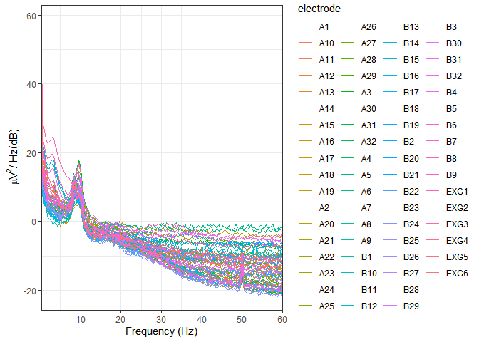
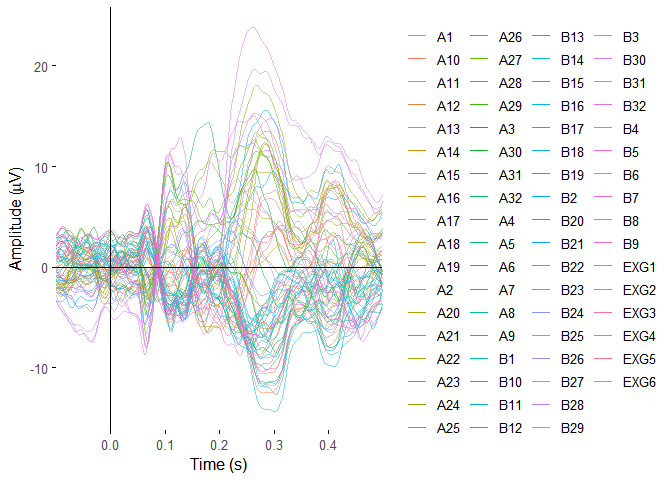
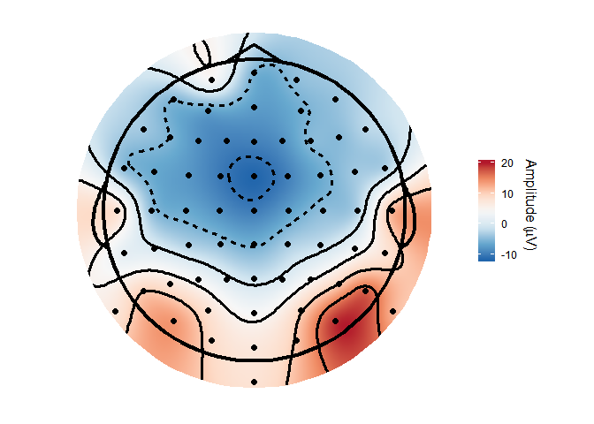
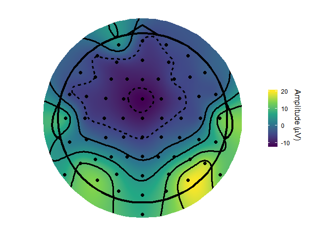
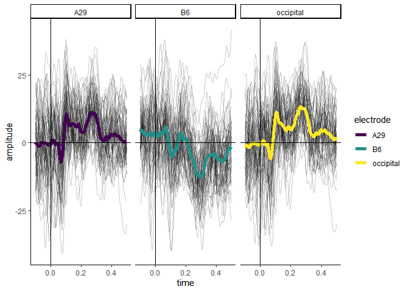

eegUtils
================

[](http://www.repostatus.org/#wip)
[](https://codecov.io/github/craddm/eegUtils?branch=master)
[](https://travis-ci.org/craddm/eegUtils)
[](https://ci.appveyor.com/project/craddm/eegUtils)
[](https://zenodo.org/badge/latestdoi/85406871)

## Overview

*eegUtils* is a package for the processing, manipulation, and plotting
of EEG data. It includes functions for importing data from a variety of
file formats (including Biosemi, Brain Vision Analyzer, and EEGLAB),
many of the typical steps in pre-preprocessing (filtering, referencing,
artefact rejection), more advanced processing techniques (time-frequency
analysis, ICA), and many types of plot that are common in the field (ERP
plots, time-frequency plots, topographical scalp maps). Although it uses
custom object classes, it is designed such that these are always
translatable to standard R *data.frames*, and thus can be used with any
of the myriad packages and methods that supports standard R formats.

## Installation

The package is very much under active development and is subject to a
lot of changes. As such, it is not currently available on CRAN. Install
the latest version from Github as below.

``` r
#install.packages("devtools")
devtools::install_packages("craddm/eegUtils")
```

Note that most development is on the **master** branch. There are
occasional Github releases that freeze functionality at particular
moments in development.

## Usage

In this simple example, we load a Biosemi .BDF file. This data is from
an experiment in which participants were cued with a word and then shown
a picture of an object that was either a semantic match or a semantic
mismatch for the word.

``` r
library(eegUtils)
#> Make sure to check for the latest development version at https://github.com/craddm/eegUtils!
#> 
#> Attaching package: 'eegUtils'
#> The following object is masked from 'package:stats':
#> 
#>     filter
library(dplyr)
#> 
#> Attaching package: 'dplyr'
#> The following objects are masked from 'package:stats':
#> 
#>     filter, lag
#> The following objects are masked from 'package:base':
#> 
#>     intersect, setdiff, setequal, union
library(ggplot2)
eeg_example <- import_raw("F:\\Dropbox\\EEGData\\RawEEGData\\BasicCat\\S2B1.bdf")
#> Importing F:\Dropbox\EEGData\RawEEGData\BasicCat\S2B1.bdf as BDF
eeg_example
#> EEG data
#> 
#> Number of channels   : 72 
#> Electrode names      : A1 A2 A3 A4 A5 A6 A7 A8 A9 A10 A11 A12 A13 A14 A15 A16 A17 A18 A19 A20 A21 A22 A23 A24 A25 A26 A27 A28 A29 A30 A31 A32 B1 B2 B3 B4 B5 B6 B7 B8 B9 B10 B11 B12 B13 B14 B15 B16 B17 B18 B19 B20 B21 B22 B23 B24 B25 B26 B27 B28 B29 B30 B31 B32 EXG1 EXG2 EXG3 EXG4 EXG5 EXG6 EXG7 EXG8 
#> Sampling rate        : 512 Hz
#> Reference        :
```

This data was recorded at 512 Hz. There were 72 channels named using the
BioSemi alpha-numeric format. EXG1-EXG4 were electrodes placed around
the eyes to record eye movements. EXG5 and EXG6 were reference
electrodes placed on the participant’s earlobes. EXG7 and EXG8 are empty
channels; no electrodes were attached.

We can use the *select\_elecs()* function to select specific channels to
keep or remove. Here we’ll remove the empty channels EXG7 and EXG8.

``` r
eeg_example %>%
  select_elecs(electrode = c("EXG7", "EXG8"),
               keep = FALSE)
#> EEG data
#> 
#> Number of channels   : 70 
#> Electrode names      : A1 A2 A3 A4 A5 A6 A7 A8 A9 A10 A11 A12 A13 A14 A15 A16 A17 A18 A19 A20 A21 A22 A23 A24 A25 A26 A27 A28 A29 A30 A31 A32 B1 B2 B3 B4 B5 B6 B7 B8 B9 B10 B11 B12 B13 B14 B15 B16 B17 B18 B19 B20 B21 B22 B23 B24 B25 B26 B27 B28 B29 B30 B31 B32 EXG1 EXG2 EXG3 EXG4 EXG5 EXG6 
#> Sampling rate        : 512 Hz
#> Reference        :
```

Note that we could also use the *select()* function from the *dplyr*
package, as *eegUtils* has wrapper functions around several *dplyr*
functions. Here we’ll use it in a chain of pipes leading to the
*eeg\_reference()* function, which references or rereferences our EEG
data. It defaults to average reference.

``` r
eeg_example <- eeg_example %>%
  select(-EXG7, -EXG8) %>%
  eeg_reference()
eeg_example
#> EEG data
#> 
#> Number of channels   : 70 
#> Electrode names      : A1 A2 A3 A4 A5 A6 A7 A8 A9 A10 A11 A12 A13 A14 A15 A16 A17 A18 A19 A20 A21 A22 A23 A24 A25 A26 A27 A28 A29 A30 A31 A32 B1 B2 B3 B4 B5 B6 B7 B8 B9 B10 B11 B12 B13 B14 B15 B16 B17 B18 B19 B20 B21 B22 B23 B24 B25 B26 B27 B28 B29 B30 B31 B32 EXG1 EXG2 EXG3 EXG4 EXG5 EXG6 
#> Sampling rate        : 512 Hz
#> Reference        : average
```

A typical step at this stage is to filter the continuous data before
epoching. We’ll quickly inspect the power spectral density, calculated
using Welch’s method, of our data using *plot\_psd()*. We then perform a
bandpass filter from .1 Hz to 40 Hz using FIR filtering, using
*eeg\_filter()*. Note that this function can be made to use multiple
cores or processes through the *future* package.

``` r
library(future)
plan(multiprocess)
plot_psd(eeg_example, 
         freq_range = c(0, 60),
         legend = FALSE)
#> Removing channel means...
```

<!-- -->

``` r
eeg_example <- eeg_filter(eeg_example,
                          low_freq = .1,
                          high_freq = 40,
                          method = "fir")
#> Band-pass FIR filter from 0.1 - 40 Hz
#> Transition bandwidth: 0.1 Hz
#> Filter order: 16896
#> Removing channel means...
plot_psd(eeg_example, 
         freq_range = c(0, 60),
         legend = FALSE)
#> Removing channel means...
```

<!-- -->

The next step is to epoch our filtered data. The trigger *201* marks
stimulus onset.

``` r
example_epochs <- epoch_data(eeg_example,
                             events = 201)
#> Removing channel means per epoch...
#> Creating 78 epochs.
example_epochs
#> Epoched EEG data
#> 
#> Number of channels   : 70 
#> Number of epochs     : 78 
#> Epoch limits     : -1 - 0.9980469 seconds
#> Electrode names      : A1 A2 A3 A4 A5 A6 A7 A8 A9 A10 A11 A12 A13 A14 A15 A16 A17 A18 A19 A20 A21 A22 A23 A24 A25 A26 A27 A28 A29 A30 A31 A32 B1 B2 B3 B4 B5 B6 B7 B8 B9 B10 B11 B12 B13 B14 B15 B16 B17 B18 B19 B20 B21 B22 B23 B24 B25 B26 B27 B28 B29 B30 B31 B32 EXG1 EXG2 EXG3 EXG4 EXG5 EXG6 
#> Sampling rate        : 512  Hz
#> Reference        : average
```

We can plot ERPs of all the channels using *plot\_butterfly()*. This can
be quite slow at high sampling rates, with many electrodes, and long
epochs. Here we’ll specify that we want the plot to be from .1s before
to .5s after stimulus onset.

``` r
plot_butterfly(example_epochs,
               time_lim = c(-.1, .5))
```

<!-- --> This outputs
a *ggplot* object with some default styling already set.

Now we might want a topographical plot. But BioSemi data files do not
include channel locations, so we need to add them ourselves.

``` r
example_epochs <- electrode_locations(example_epochs,
                                      montage = "biosemi64alpha")
#> Electrodes not found: EXG1Electrodes not found: EXG2Electrodes not found: EXG3Electrodes not found: EXG4Electrodes not found: EXG5Electrodes not found: EXG6
channels(example_epochs)
#> # A tibble: 70 x 9
#>    electrode radius theta   phi cart_x cart_y cart_z     x     y
#>    <chr>      <dbl> <dbl> <dbl>  <dbl>  <dbl>  <dbl> <dbl> <dbl>
#>  1 A1             1   -92   -72  -26.2   80.8  -2.97 -28.4  87.5
#>  2 A2             1   -92   -54  -49.9   68.7  -2.97 -54.1  74.4
#>  3 A3             1   -74   -65  -34.5   74.0  23.4  -31.3  67.1
#>  4 A4             1   -50   -68  -24.4   60.4  54.6  -18.7  46.4
#>  5 A5             1   -60   -51  -46.3   57.2  42.5  -37.8  46.6
#>  6 A6             1   -75   -41  -62.0   53.9  22    -56.6  49.2
#>  7 A7             1   -92   -36  -68.7   49.9  -2.97 -74.4  54.1
#>  8 A8             1   -92   -18  -80.8   26.2  -2.97 -87.5  28.4
#>  9 A9             1   -72   -21  -75.5   29.0  26.3  -67.2  25.8
#> 10 A10            1   -50   -28  -57.5   30.6  54.6  -44.2  23.5
#> # ... with 60 more rows
```

Now we can create a topopgraphical plot, again with default stylings and
colour schemes.

``` r
topoplot(example_epochs, time_lim = c(.25, .35))
#> Warning: Column `electrode` joining factor and character vector, coercing
#> into character vector
#> Warning in topoplot.data.frame(data, time_lim = time_lim, limits =
#> limits, : Removing channels with no location.
```

<!-- -->

Since this is a *ggplot*, styling can be changed easily. For example, we
could use a different colour scale, such as *viridis*.

``` r
topoplot(example_epochs,
         time_lim = c(.25, .35)) +
  scale_fill_viridis_c()
#> Warning: Column `electrode` joining factor and character vector, coercing
#> into character vector
#> Warning in topoplot.data.frame(data, time_lim = time_lim, limits =
#> limits, : Removing channels with no location.
#> Scale for 'fill' is already present. Adding another scale for 'fill',
#> which will replace the existing scale.
```

<!-- -->

At any point, `eegUtils` objects can be transformed into data frames for
use with functions that don’t natively support them.

``` r
example_epochs %>%
  select_epochs(epoch_no = 1:30) %>%
  select_elecs(c("A29", "B6")) %>%
  select_times(c(-.1, .4)) %>%
  rm_baseline(c(-.1, 0)) %>%
  as.data.frame(long = TRUE) %>%
  ggplot(aes(x = time, y = amplitude)) +
  geom_line(aes(group = epoch), alpha = 0.2) + 
  stat_summary(fun.y = mean,
               geom = "line",
               size = 2,
               aes(colour = electrode)) + 
  geom_vline(xintercept = 0) +
  geom_hline(yintercept = 0) +
  facet_wrap(~electrode) + 
  theme_classic()
#> Warning: Column `electrode` joining factor and character vector, coercing
#> into character vector
```

<!-- -->

In addition, there are overloaded versions of some `dplyr` functions
that operate on the `signals` element of `eeg_data` and `eeg_epochs`
objects. For example, `select()` can be used to choose particular
electrodes, and `filter()` can be used to filter out epochs or
timepoints. `mutate()` can be used to add new columns (e.g. creating
ROIs from multiple electrodes). Note that the objects can also be passed
directly to *ggplot()*.

``` r
example_epochs %>%
  mutate(occipital = (A29 + A27 + B32) / 3) %>%
  select(A29, B6, occipital) %>%
  filter(epoch <= 60, time > -.1, time < .5) %>%
  ggplot(aes(x = time, y = amplitude)) +
  geom_line(aes(group = epoch), alpha = 0.2) + 
  stat_summary(fun.y = mean,
               geom = "line",
               size = 2,
               aes(colour = electrode)) +
  facet_wrap(~electrode) + 
  scale_colour_viridis_d() +
  geom_vline(xintercept = 0) +
  geom_hline(yintercept = 0) +
  theme_classic()
#> Warning: Column `electrode` joining factor and character vector, coercing
#> into character vector
```

<!-- -->
